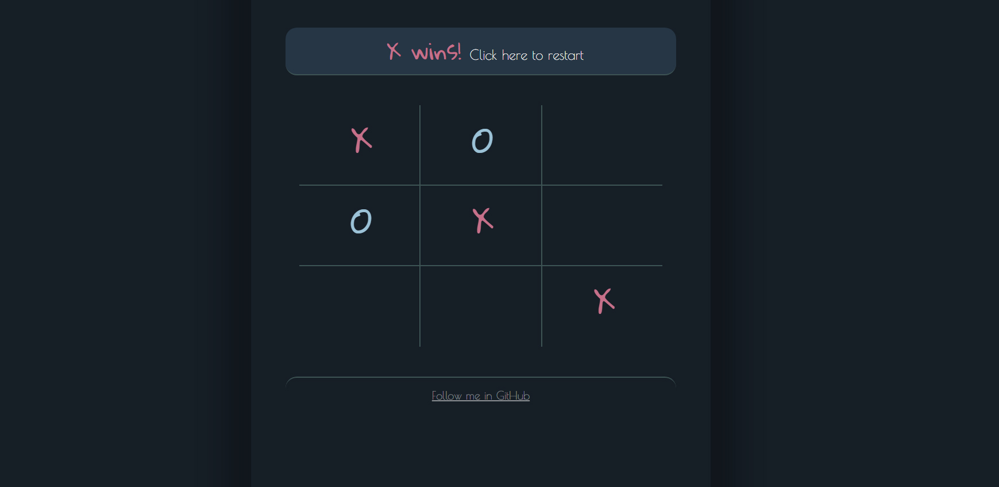

### Tic Tac Toe with React - MIT Lab

# Title

Tic Tac Toe with React

# Description

This project shows a Tic Tac Toe board which enables to to quickly play with a friend.

It was created as part of a proposed assignment during the Full Stack Development Professional Certificate career in 2021.

It uses React and Bootstrap as a starting point for styling.

Live Preview: https://renzodupont.github.io/mit-career-2021/week-16/

# How to Run

1 - Clone the repository in your local computer 
2 - Run

### `npm install`

This will get all the needed dependencies in your folder
3 - Finally in the project directory, run:

### `npm start`

Runs the app in the development mode.\
Open [http://localhost:3000](http://localhost:3000) to view it in the browser.

# Future improvements

- Enable you to play with the computer instead of with someone else

# Contact info

📫 https://www.linkedin.com/in/renzo-dupont-b9797941/ | https://twitter.com/renzodupont | https://instagram.com/renzondl

# License information

MIT Licensed
